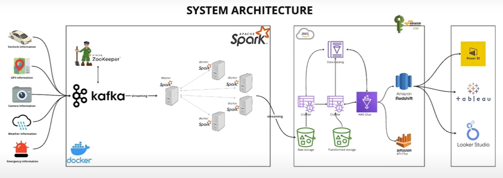

# Smart-city-End-to-End-DataEngineering-Project
In this project we will be building a pipeline to stream,process and visualize real time data received from IOT devices.
Based on the information that is generated from the IOT devices, we can get GPS,traffic,weather,emergency incident update for anyone travelling on a particular route.

# TechStack Used
 - AWS Athena
 - AWS RedShift
 - AWS Glue
 - AWS S3
 - Zookeeper
 - Kafka
 - Spark
 - Docker
 - Tableau
 - Python3.8

 ## System Architecture
 

 ## To delete any kafka topic
    kafka-topics --delete <topic_name>
 ## To check Kafka topics created
    kafka-topics --list --bootstrap-server broker:29092

## To run spark jobs
docker exec -it smart-city-end-to-end-dataengineering-project-spark-master-1 spark-submit --master spark://spark-master:7077 --packages org.apache.spark:spark-sql-kafka-0-10_2.12:3.5.0,org.apache.hadoop:hadoop-aws:3.3.1,com.amazonaws:aws-java-sdk:1.11.469 jobs/spark-city.py
    